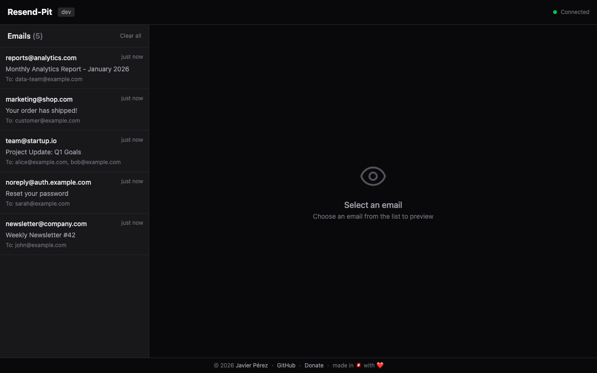
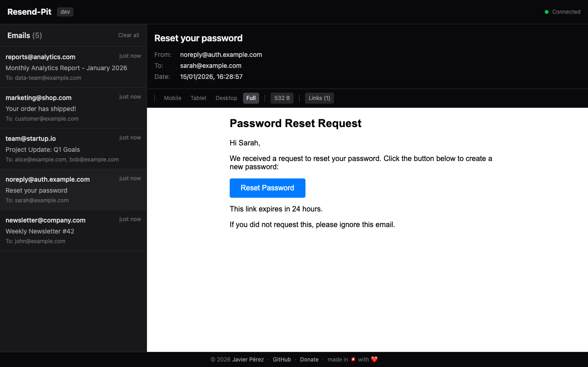
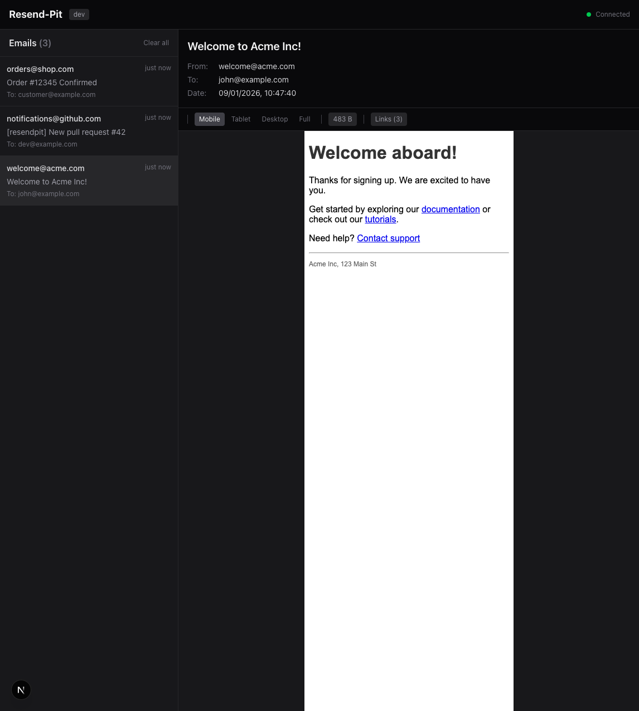
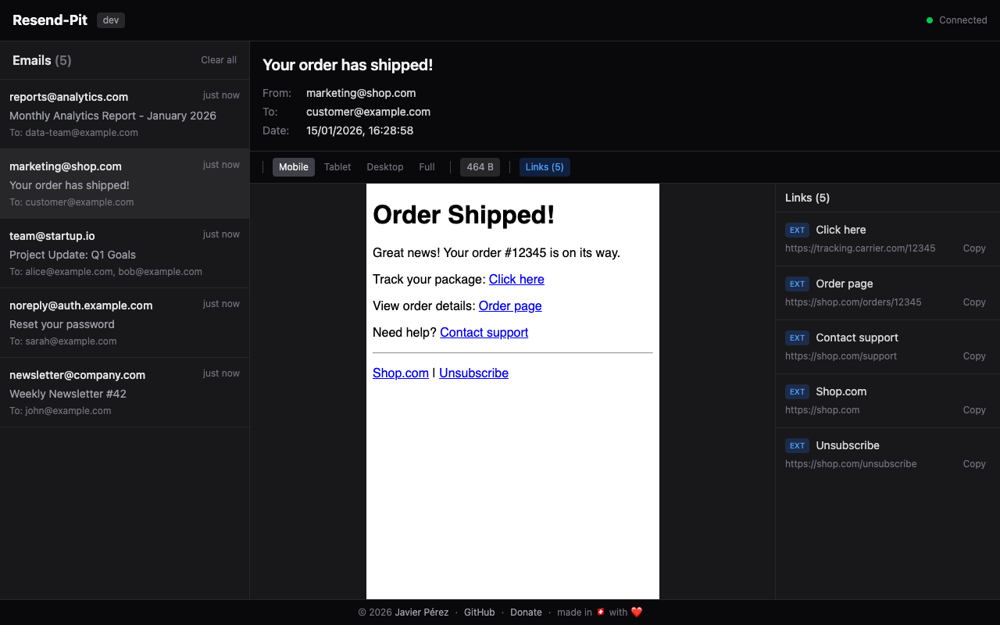
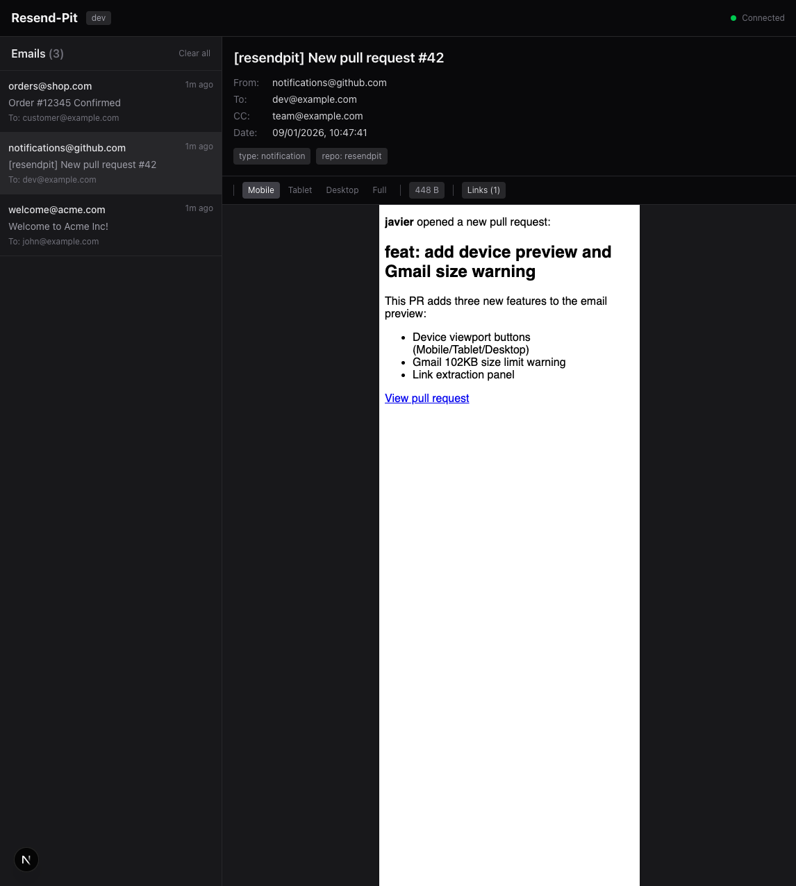
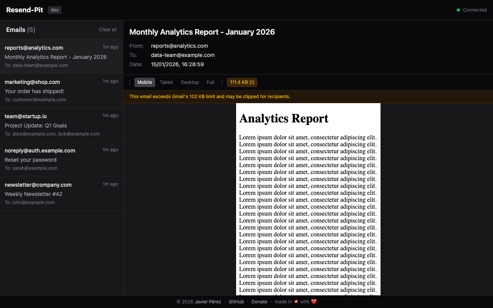

# Resend-Pit

A local email interceptor for the [Resend](https://resend.com) SDK. Capture and preview emails during development without sending them to real recipients.

## Features

- **Drop-in replacement** - Just set one environment variable
- **Real-time dashboard** - See emails instantly via Server-Sent Events
- **Full Resend API compatibility** - Works with any Resend SDK
- **React Email support** - Renders HTML emails beautifully
- **Zero configuration** - Works out of the box
- **Docker ready** - Single container deployment (~15 MB image)
- **Minimal footprint** - ~5-10 MB RAM usage

## Screenshots

### Email List


### Email Preview


### Mobile Preview
Test responsive emails with device viewport buttons (Mobile 375px, Tablet 768px, Desktop 1024px).



### Link Analysis
Extract and inspect all links from your emails.



### Email with Tags
View email metadata including tags and CC recipients.



### Gmail Size Warning
Get alerted when your email exceeds Gmail's 102 KB clipping limit.



## Quick Start

### Docker (Recommended)

```bash
docker run -p 3000:3000 appaka/resendpit
```

### From Source

```bash
git clone https://github.com/appaka/resendpit.git
cd resendpit

# Build frontend
cd frontend && pnpm install && pnpm build && cd ..

# Run backend
cd backend && go run .
```

Or use the Makefile:

```bash
make build
make dev
```

Then open http://localhost:3000 to view the dashboard.

## Integration

Point your Resend SDK to Resend-Pit by setting the `RESEND_BASE_URL` environment variable:

```bash
# In your application's .env file
RESEND_BASE_URL=http://localhost:3000
RESEND_API_KEY=re_anything  # Any value works, it's ignored
```

That's it! All emails sent via the Resend SDK will now be captured by Resend-Pit.

### Example with Node.js

```javascript
import { Resend } from 'resend';

// SDK automatically uses RESEND_BASE_URL if set
const resend = new Resend('re_123456789');

await resend.emails.send({
  from: 'you@example.com',
  to: 'user@example.com',
  subject: 'Hello World',
  html: '<h1>Welcome!</h1>',
});
// Email captured by Resend-Pit instead of being sent
```

### Docker Compose

```yaml
services:
  app:
    build: .
    environment:
      - RESEND_BASE_URL=http://resendpit:3000
      - RESEND_API_KEY=re_123456789
    depends_on:
      - resendpit

  resendpit:
    image: appaka/resendpit
    ports:
      - "3000:3000"
```

## Configuration

| Variable | Default | Description |
|----------|---------|-------------|
| `PORT` | `3000` | Server port |
| `RESENDPIT_MAX_EMAILS` | `50` | Maximum emails to store (FIFO) |

### Examples

```bash
# Custom port
docker run -p 8080:8080 -e PORT=8080 appaka/resendpit

# Store more emails
docker run -p 3000:3000 -e RESENDPIT_MAX_EMAILS=200 appaka/resendpit
```

## API Reference

Resend-Pit implements the Resend API endpoints:

### POST /emails

Create an email (Resend SDK endpoint).

```bash
curl -X POST http://localhost:3000/emails \
  -H "Content-Type: application/json" \
  -d '{
    "from": "sender@example.com",
    "to": ["recipient@example.com"],
    "subject": "Test Email",
    "html": "<h1>Hello</h1>"
  }'
```

**Response:**
```json
{ "id": "550e8400-e29b-41d4-a716-446655440000" }
```

### GET /api/emails

List all stored emails.

```bash
curl http://localhost:3000/api/emails
```

### DELETE /api/emails

Clear all stored emails.

```bash
curl -X DELETE http://localhost:3000/api/emails
```

### GET /api/health

Health check endpoint.

```bash
curl http://localhost:3000/api/health
```

**Response:**
```json
{
  "status": "ok",
  "emails": 5,
  "maxEmails": 50,
  "timestamp": "2024-01-15T10:30:00Z"
}
```

### GET /api/events

Server-Sent Events stream for real-time updates.

**Events:**
- `init` - Initial state with all current emails
- `new-email` - New email received
- `clear` - All emails cleared

## Supported Email Fields

| Field | Type | Description |
|-------|------|-------------|
| `from` | string | Sender email (required) |
| `to` | string \| string[] | Recipient(s) (required) |
| `subject` | string | Email subject (required) |
| `html` | string | HTML content |
| `text` | string | Plain text content |
| `cc` | string \| string[] | CC recipients |
| `bcc` | string \| string[] | BCC recipients |
| `reply_to` | string | Reply-to address |
| `tags` | array | Email tags `[{name, value}]` |
| `attachments` | array | Attachment metadata |

## Architecture

```
resendpit/
├── backend/              # Go backend (net/http)
│   ├── main.go           # HTTP server + static files
│   ├── handlers/         # API handlers
│   ├── store/            # In-memory store
│   └── types/            # Go structs
├── frontend/             # React frontend (Vite)
│   ├── src/
│   │   ├── App.tsx       # Dashboard
│   │   └── components/   # UI components
│   └── package.json
├── Dockerfile            # Multi-stage build
└── Makefile              # Build commands
```

## How It Works

```
┌─────────────────┐     POST /emails      ┌──────────────────┐
│   Your App      │ ────────────────────► │   Resend-Pit     │
│  (Resend SDK)   │                       │   (Go backend)   │
└─────────────────┘                       └────────┬─────────┘
                                                   │
                                                   ▼
                                         ┌──────────────────┐
                                         │  In-Memory Store │
                                         │   (FIFO Queue)   │
                                         └────────┬─────────┘
                                                  │ SSE
                                                  ▼
┌─────────────────┐     Real-time         ┌──────────────────┐
│    Dashboard    │ ◄──────────────────── │   SSE Stream     │
│    (React)      │                       │                  │
└─────────────────┘                       └──────────────────┘
```

1. Your app sends emails via Resend SDK
2. SDK calls `RESEND_BASE_URL/emails` instead of Resend's API
3. Resend-Pit stores the email and returns a fake ID
4. Dashboard receives real-time updates via SSE

## Limitations

- **No persistence** - Emails are stored in memory and lost on restart
- **No actual sending** - Emails are captured, not forwarded
- **Development only** - Not intended for production use

## Alternatives

- [Mailpit](https://github.com/axllent/mailpit) - SMTP-based email testing
- [Mailtrap](https://mailtrap.io) - Cloud-based email testing

Resend-Pit is specifically designed for the Resend SDK and doesn't require SMTP configuration.

## License

MIT

## Contributing

Contributions are welcome! Please open an issue or submit a pull request.

```bash
# Development (concurrent frontend + backend)
make dev

# Build frontend and backend
make build

# Docker build
make docker

# Test endpoints
make test
```
